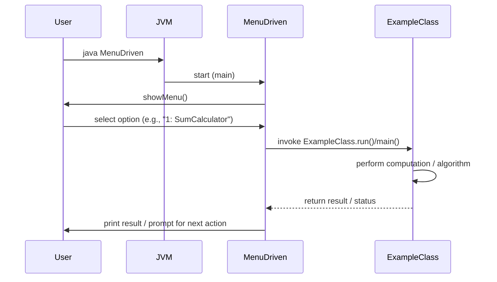
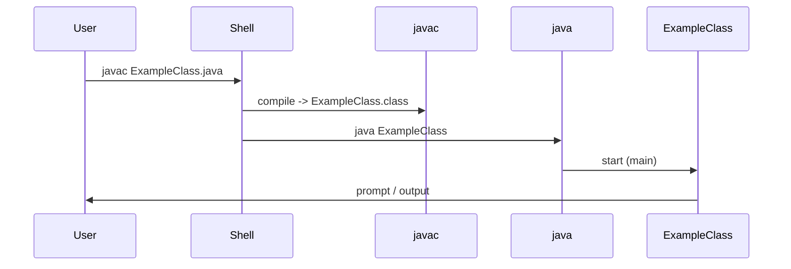
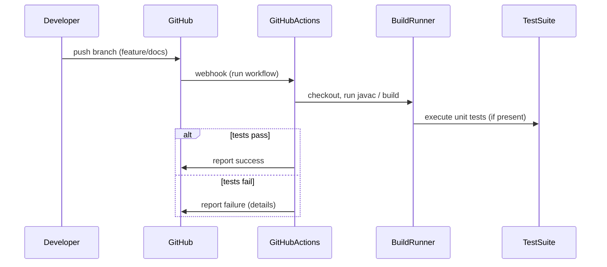

# kiruthick-java — Design Document

## Purpose
This repository is a collection of small Java programs and exercises (console/BlueJ style) demonstrating algorithms, number puzzles, and simple interactive programs. The goal is educational: to present runnable examples that illustrate core Java programming concepts.

## Scope
- Catalog and describe the existing programs.
- Explain how to build and run them locally (javac/java and BlueJ).
- Describe typical runtime flows with Mermaid sequence diagrams (see SEQUENCE_DIAGRAMS.md).
- Recommendations for organizing, testing, and documenting the examples.

## Repository structure (root)
- Java source files (examples, many in root):
    - GamesProgram.java
    - MenuDriven.java
    - SumCalculator.java
    - StringManipulator.java
    - MovieMagic.java
    - ElectricBill.java
    - TicTacToe.class (compiled)
    - ...and other small programs (BookFair, DisariumNumber, DudeneyNumber, HappyNumber, OverloadSum, RockPaperScissors, etc.)
- .gitignore
- docs/ (empty, reserved)
- package.bluej / BlueJ project metadata

Note: Many compiled `.class` files are present; consider removing compiled artifacts from the repo and adding a .gitignore rule to avoid them.

## Actors
- Developer (author/maintainer)
- Learner / Reader (runs programs locally)
- Build tool (javac / optional IDE or BlueJ)
- Operating system / Java runtime

## Key ideas & responsibilities
- Each .java file is a self-contained example with a `main` method or BlueJ-style class.
- `MenuDriven.java` provides a menu-based entry point that dispatches to several example programs.
- Programs focus on algorithmic logic rather than network or persistence concerns.

## Build & run (recommended)
1. Install JDK (11+ recommended, adjust if code uses older constructs).
2. From repository root:
    - Compile all .java files:
      javac *.java
    - Run a program (example):
      java MenuDriven
3. Alternatively open in BlueJ if you use the BlueJ project files.

## Error handling and assumptions
- Programs are console-based with minimal input validation. As these are examples, input validation is usually simple (e.g., numeric parsing and basic checks).
- When converting to a larger project, add robust input validation, unit tests, and structured error handling.

## Recommendations / Next steps
- Remove .class files from source control and add them to .gitignore.
- Move examples into src/ with package namespaces (e.g., src/main/java/com/yourname/examples) to align with standard Java project conventions.
- Add a build tool (Maven or Gradle) to allow `mvn test`, `mvn package`, and to manage JDK compatibility.
- Add README entries per example explaining purpose, usage, and expected input/output.
- Add unit tests (JUnit) for algorithmic methods (separate from interactive main methods).
- Add the design docs (DESIGN.md, ARCHITECTURE.md, SEQUENCE_DIAGRAMS.md) to `feature/docs` branch and open a PR for review.

# Sequence Diagrams (Mermaid)

Below are Mermaid sequence diagrams that describe the common interactions for the programs in this repository. Copy the mermaid code blocks into a Markdown file or a Mermaid live editor to render them.

## 1) User runs MenuDriven and selects an example

Notes:
- `MenuDriven` may directly call static `main` methods or instantiate classes and call instance methods.
- Examples are synchronous and console-based.

## 2) Running a single example directly

Notes:
- Compile step (javac) produces .class files; consider using a build tool to manage compilation.

## 3) Developer push -> CI (recommended)

Notes:
- The repository currently lacks a CI workflow and unit tests — adding GitHub Actions with `javac` and JUnit steps is recommended.

## How to render
- GitHub's markdown currently supports Mermaid diagrams in some contexts. Use a Mermaid-enabled viewer or VS Code extension for preview.
- For CLI rendering: use mermaid-cli or embed diagrams in GitHub Pages.

# Architecture Overview — kiruthick-java

## High-level view
This repo is a collection of standalone console programs. There is no server, persistence, or external integrations. The architecture is intentionally minimal:

- Programs
    - Each file contains one example class (often with `main`).
    - `MenuDriven` acts as a launcher/menu dispatcher for interactive selection.
- Local execution environment
    - JDK runtime (java) and compiler (javac) execute the compiled classes.
- Optional BlueJ support
    - BlueJ metadata files are present (package.bluej, .ctxt) and can be used to open the examples in BlueJ.

## Component descriptions
- Launcher (MenuDriven.java)
    - Presents a menu and calls example classes based on user input.
- Example Classes (SumCalculator, StringManipulator, GamesProgram, etc.)
    - Contain application logic and console interaction.
- Project metadata (package.bluej, team.defs)
    - BlueJ and team project configuration files for educational use.

## Developer workflows
- Local build
    - javac *.java
    - java MenuDriven
- BlueJ
    - Open the project in BlueJ for visual class interactions.

## Recommended packaging & modernization path
If the repository should evolve into a maintainable library or multi-module project:
1. Introduce Maven or Gradle.
2. Reorganize sources into a standard layout:
    - src/main/java/com/username/examples/...
    - src/test/java/... (JUnit tests)
3. Remove binary files (.class) from git.
4. Add a CI pipeline (GitHub Actions) to run build and unit tests on PRs.
5. Document each example with usage and expected behavior.

## Non-functional considerations
- Simplicity: Keep examples focused and single-responsibility.
- Reproducibility: Include JDK version in documentation.
- Education: Use comments and README fragments to explain algorithms.
