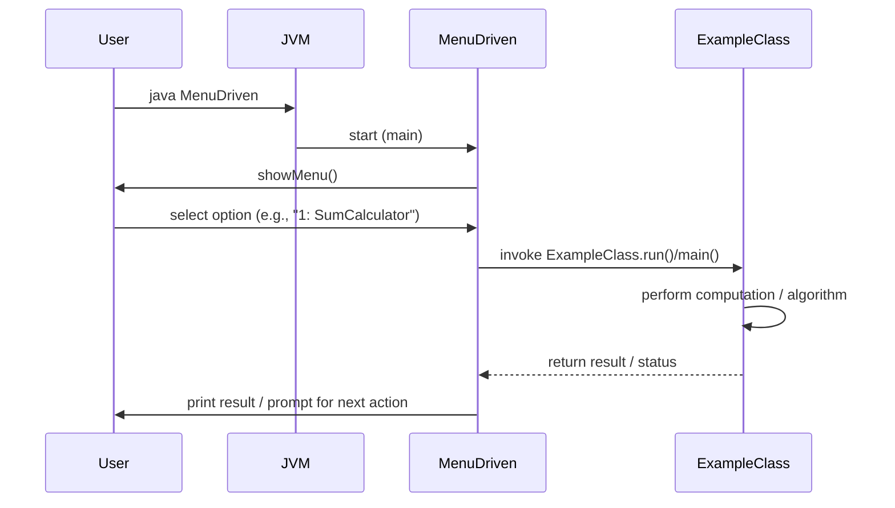
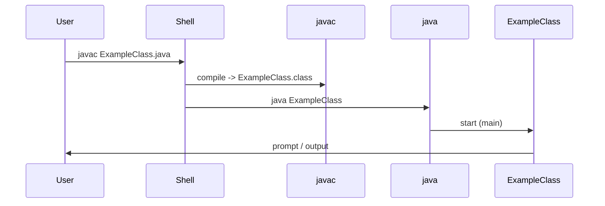
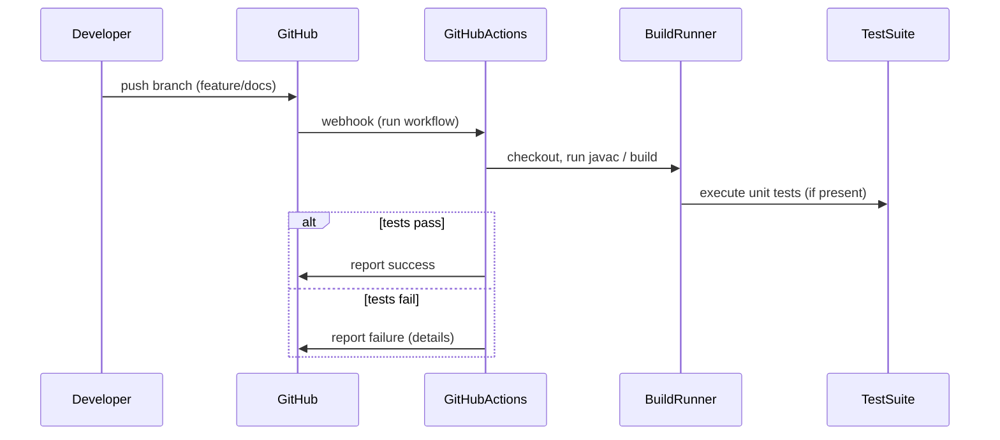

# Sequence Diagrams (Mermaid)

Below are Mermaid sequence diagrams that describe the common interactions for the programs in this repository. Copy the mermaid code blocks into a Markdown file or a Mermaid live editor to render them.

## 1) User runs MenuDriven and selects an example

Notes:
- `MenuDriven` may directly call static `main` methods or instantiate classes and call instance methods.
- Examples are synchronous and console-based.

## 2) Running a single example directly

Notes:
- Compile step (javac) produces .class files; consider using a build tool to manage compilation.

## 3) Developer push -> CI (recommended)

Notes:
- The repository currently lacks a CI workflow and unit tests — adding GitHub Actions with `javac` and JUnit steps is recommended.

## How to render
- GitHub's markdown currently supports Mermaid diagrams in some contexts. Use a Mermaid-enabled viewer or VS Code extension for preview.
- For CLI rendering: use mermaid-cli or embed diagrams in GitHub Pages.
